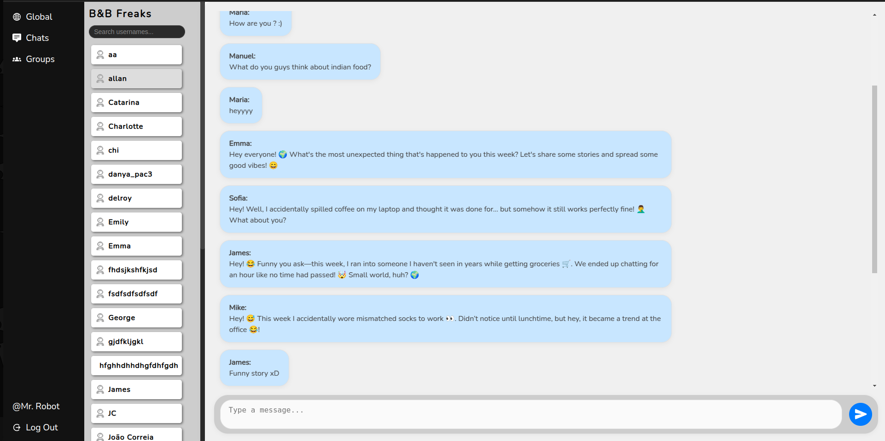

# Binary Buzz

Binary Buzz is a messaging web application that allows users to send messages to each other, create group chats, and authenticate securely.

## Screenshots

| Global Chat                                                      | Group Chat                                               | Private Chat                                                  |
| ---------------------------------------------------------------- | -------------------------------------------------------- | ------------------------------------------------------------- |
|  |  |  |

## Live

Live at: https://binary-buzz-production.up.railway.app/log-in

## Features

- **User Authentication**: Secure login and registration system.
- **Direct Messaging**: Users can send messages to other users.
- **Group Chats**: Users can create and participate in group conversations.
- **Modern UI**: Built using React with Vite for fast performance.
- **Backend with Node.js and Express**: Handles authentication and messaging.
- **Responsive Design**: Fully optimized for both mobile and desktop users.
- **Database with Prisma and PostgreSQL**: Efficient and scalable data management.

## Tech Stack

### Frontend

- React with Vite
- React Router for navigation
- Tailwind CSS for styling
- Axios for API requests

### Backend

- Node.js with Express.js
- Prisma ORM with PostgreSQL
- JSON Web Tokens (JWT) for authentication
- bcrypt for password hashing

## Installation

### Prerequisites

- Node.js and npm installed
- PostgreSQL database setup

### Clone the repository

```bash
git clone [https://github.com/your-username/binary-buzz.git](https://github.com/joaocorreiaprof/Binary-Buzz)
cd binary-buzz
```

### Backend Setup

```bash
cd server
npm install
```

#### Create a `.env` file in the `server` directory

```env
PORT=5000
DATABASE_URL=your_postgresql_connection_string
JWT_SECRET=your_secret_key
```

#### Run database migrations

```bash
npx prisma migrate dev
```

#### Start the backend server

```bash
npm start
```

### Frontend Setup

```bash
cd ../client
npm install
```

#### Start the frontend development server

```bash
npm run dev
```

## Usage

1. Sign up or log in to the application.
2. Start a direct chat with another user.
3. Create or join a group chat.
4. Send and receive messages in real time.
5. Use the app seamlessly on both mobile and PC.

## Future Improvements

- WebSockets for real-time message updates
- User profile customization
- Message reactions and attachments

## Contributing

Pull requests are welcome! Please open an issue first to discuss any major changes.

## License

This project is open-source and available under the [MIT License](LICENSE).
